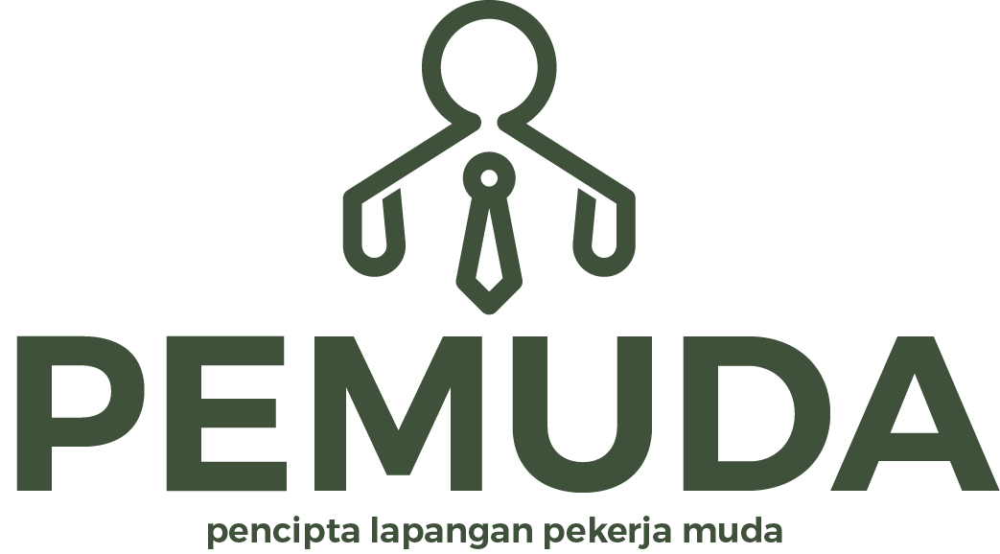

# About this Capstone Project

This project aims to develop a Youth Employment Application that helps job seekers find positions that match their skills and preferences, addressing the urgent issue of unemployment. Unemployment has become a major concern for governments, businesses, and communities, especially worsened by recent global economic shifts that have led to job losses and increased competition for available positions. The application will provide a platform for job seekers to efficiently search for job openings, including both permanent and daily positions, with features such as user and employer ratings to build trust.

The need for a platform connecting job seekers and employers has never been more critical. The pandemic has highlighted the challenges faced by educated workers, with unemployment rates rising from 6.69% in 2020 to 8.55% in 2021. This application will streamline the job search process, making it easier for candidates to find work and for employers to identify suitable candidates quickly. Ultimately, our goal is to reduce unemployment rates and contribute positively to economic growth by facilitating effective matches between job seekers and employers.

## Bangkit Product-based Capstone Project

PeMuda is built as a requirement for Bangkit 2024's Product-based Capstone Project. This repository is built as an all-in-one access for every repository used by this project (links to each repo are included below).

### Design Figma

[Figma](https://www.figma.com/design/JFaEJtDeiicLw2qXf4NIJG/CAPSTONE-PROJECT!?node-id=0-1&m=dev&t=95pN8c241eR2rgve-1)

[Design Database](https://drive.google.com/file/d/1-lFNpZkEQUc-dymUHK-iluWzb-792zMw/view?usp=sharing)

### Team Members

| Member                        | Student ID      | Path                | Contacts                    |
|-------------------------------|-----------------|---------------------|-----------------------------|
| I Gede Made Rapriananta Pande | M014B4KY1814    | Machine Learning     | [GitHub](https://github.com/MadRapz) |
| I Gede Satya Ariya Putra Sangjaya | M014B4KY1817 | Machine Learning     | [GitHub](https://github.com/Satyaaps) |
| Syelvia Julianti             | M014B4KX4269    | Machine Learning     | [GitHub](https://github.com/syelvia) |
| I Putu Gede Surya Pratama    | C014B4KY1879    | Cloud Computing      | [GitHub](https://github.com/2205551032-Surya) |
| Ni Putu Sri Indah Damayanti   | C014B4KX3350    | Cloud Computing      | [GitHub](https://github.com/IndahDamayanti) |
| Athaya Juliant Purnama       | A014B4KY0709    | Mobile Development   | [GitHub](https://github.com/athayapurnama02) |
| Adriant Satrio Putra         | A014B4KY0135    | Mobile Development   | [GitHub](https://github.com/adriant2) |

### Repositories of all the Cohorts

| Paths                | Link                        |
|----------------------|-----------------------------|
| Mobile Development    | [GitHub](https://github.com/athayapurnama02/PeMuda-MD-repo) |
| Machine Learning      | [GitHub](https://github.com/) |
| Cloud Computing       | [GitHub](https://github.com/2205551032-Surya/CloudComputing) |
